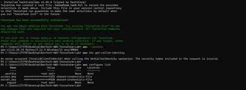
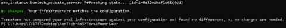

# Project Evidence

This folder contains **sanitized technical evidence** from the BonTech AWS Cloud Security Engineering Lab.

The goal is not to publish every screenshot from the private engineering report. Instead, this public portfolio presents a small set of high-value evidence that demonstrates design, monitoring, troubleshooting, automation, and validation while excluding sensitive account information.

## Evidence Map

| Evidence | What it demonstrates |
|---|---|
| [`01-vpc-flow-logs.md`](01-vpc-flow-logs.md) | Network telemetry, ACCEPT/REJECT flow interpretation, and investigation reasoning |
| [`02-cloudwatch-detection.md`](02-cloudwatch-detection.md) | Metric filter, custom security metric, CloudWatch alarm, and notification pipeline |
| [`03-terraform-validation.md`](03-terraform-validation.md) | Terraform initialization, infrastructure-as-code workflow, and controlled change validation |
| [`04-zero-drift.md`](04-zero-drift.md) | Final Terraform drift check showing configuration and deployed infrastructure aligned |

## Sanitized Screenshot Gallery

### 1. VPC Flow Logs

Demonstrates network telemetry review and the use of VPC Flow Logs as evidence during investigation.

### 2. CloudWatch Detection

Demonstrates the detection path from rejected network traffic to a CloudWatch security alarm.

### 3. Terraform Apply and Controlled Change

Demonstrates Infrastructure as Code execution and controlled resource change after reviewing Terraform's plan.

### 4. Terraform Zero-Drift Validation

Demonstrates the final validation checkpoint showing that the deployed infrastructure matched the declared Terraform configuration at the time of testing.

## Public Evidence Policy

The complete private engineering report contains additional screenshots and identifiers that are intentionally **not** published here.

Public evidence excludes or redacts:

- AWS account IDs
- Access-key IDs and secret access keys
- Private keys and `.pem` files
- MFA seeds or QR codes
- SNS unsubscribe links and subscription identifiers
- Request/finding identifiers where not needed
- Terraform state files
- Local credential files

The evidence in this repository is therefore designed to show **technical capability without exposing operational secrets or unnecessary cloud identifiers**.

## Validation Philosophy

Throughout the project, I did not treat successful resource creation as sufficient proof. I validated the system using network tests, SSH access paths, NAT egress checks, log analysis, security alerts, Terraform state inspection, and a final zero-drift plan.

This approach reflects a central lesson from the project:

> Build, observe, test, investigate, harden, and then verify again.
